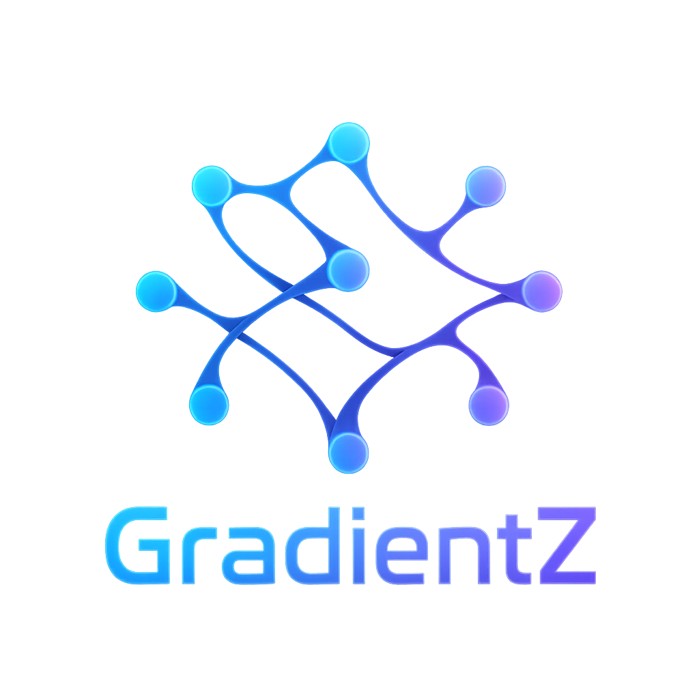

A autograd engine implementation inspired by [micrograd](https://github.com/karpathy/micrograd), but with tensor support written in Zig.
This library is a toy project made for educational purposes, to learn more about Zig and how to implement a tensor library with autograd capabilities.

# Current Features

### Tensor Creation and Management

-   [X] Multi-dimensional tensor support (0D, 1D, 2D, 3D, N-D)
-   [X] Memory-efficient row-major layout
-   [X] CPU backend with full functionality
-   [X] Device abstraction (CPU ready, GPU planned)
-   [X] Shape validation and error handling
-   [X] Tensor visualization and pretty printing

### Basic Arithmetic Operations (Element-wise)

-   [X] Addition (`add`) - works on all dimensions
-   [X] Subtraction (`sub`) - works on all dimensions
-   [X] Multiplication (`mul`) - element-wise, works on all dimensions
-   [X] Division (`div`) - element-wise with zero checking
-   [X] Power (`pow`) - element-wise exponentiation
-   [X] Negation (`neg`) - element-wise negation

### Matrix Operations

-   [X] Matrix multiplication (`matmul`)
-   [X] Shape compatibility checking
-   [X] Transpose (`transpose`) - for 2D tensors

### Utility Functions

-   [X] `zeros()` - create zero-filled tensors
-   [X] `ones()` - create one-filled tensors
-   [X] `fill()` - fill tensor with constant value
-   [X] `setData()` - set tensor data from slice

### Activation Functions

-   [X] ReLU (`relu`) - max(0, x)
-   [X] Sigmoid (`sigmoid`) - 1/(1+exp(-x))
-   [X] Tanh (`tanh`) - hyperbolic tangent
-   [X] Exponential (`exp`) - ex
-   [X] Natural log (`log`) - ln(x)
-   [X] Square root (`sqrt`) - √x
-   [X] Absolute value (`abs`) - |x|

### Reduction Operations

-   [X] Sum (`sum`) - sum all elements to scalar
-   [X] Mean (`mean`) - average of all elements
-   [ ] Max (`max`) - maximum element
-   [ ] Min (`min`) - minimum element

### Advanced Operations

-   [ ] Element-wise maximum (`maximum`) - max(a, b)
-   [X] Sine (`sin`) - sin(x)
-   [X] Cosine (`cos`) - cos(x)

### Broadcasting Support

-   [ ] Addition with broadcasting (`addBroadcast`)

### Neural Network Module (PyTorch-like API) needs fixes before beeing used

-   [X] `nn.Module` - Base module class (similar to PyTorch&rsquo;s nn.Module)
-   [X] `nn.Linear` - Fully connected layer with Xavier initialization and bias
-   [X] `nn.ReLU` - ReLU activation function
-   [X] `nn.Sigmoid` - Sigmoid activation function
-   [X] `nn.SimpleMLP` - Multi-layer perceptron implementation
-   [X] Forward pass implementation for all layers
-   [X] Batch processing support (2D inputs)
-   [X] Automatic gradient computation support
-   [X] Memory management with proper cleanup

# Examples

## Running Examples

    # Run individual examples
    zig build example-scalars      # 0D tensors (scalars)
    zig build example-vectors      # 1D tensors (vectors)
    zig build example-matrices     # 2D tensors (matrices)
    zig build example-3d           # 3D tensors
    zig build example-autograd     # Automatic differentiation
    zig build example-mlp          # Multi-Layer Perceptron
    zig build example-devices      # Device functionality
    zig build example-training     # Training with gradient descent
    zig build example              # PyTorch-like API example
    
    # Run all examples
    zig build examples

## Quick Demo

    const std = @import("std");
    const GradientZ = @import("GradientZ_lib");
    
    pub fn main() !void {
        // Initialize library
        GradientZ.init();
    
        var gpa = std.heap.GeneralPurposeAllocator(.{}){};
        defer _ = gpa.deinit();
        const allocator = gpa.allocator();
    
        // Create tensors
        var a = try GradientZ.zeros(allocator, &.{2, 3}, GradientZ.cpu());
        defer a.deinit();
    
        var b = try GradientZ.ones(allocator, &.{2, 3}, GradientZ.cpu());
        defer b.deinit();
    
        // Basic operations
        var result = try a.add(&b);
        defer result.deinit();
        try result.print();
    }

## Example Categories

-   **Basic Operations**: [scalars0d.zig](examples/scalars_0d.zig), [vectors1d.zig](examples/vectors_1d.zig), [matrices2d.zig](examples/matrices_2d.zig), [tensors3d.zig](examples/tensors_3d.zig)
-   **Automatic Differentiation**: [autograd.zig](examples/autograd.zig)
-   **Neural Networks**: [mlp.zig](examples/mlp.zig), [pytorchlike.zig](examples/pytorch_like.zig)
-   **Training**: [training.zig](examples/training.zig)
-   **Device Management**: [devices.zig](examples/devices.zig)

